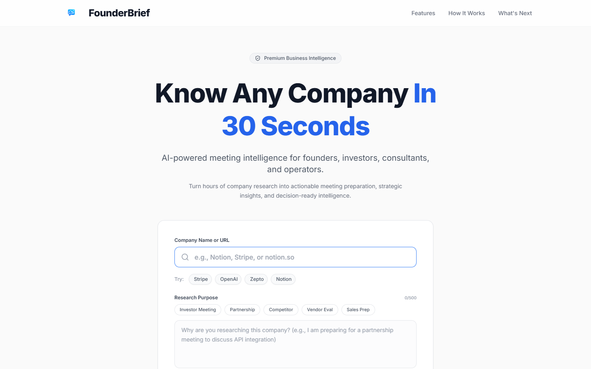
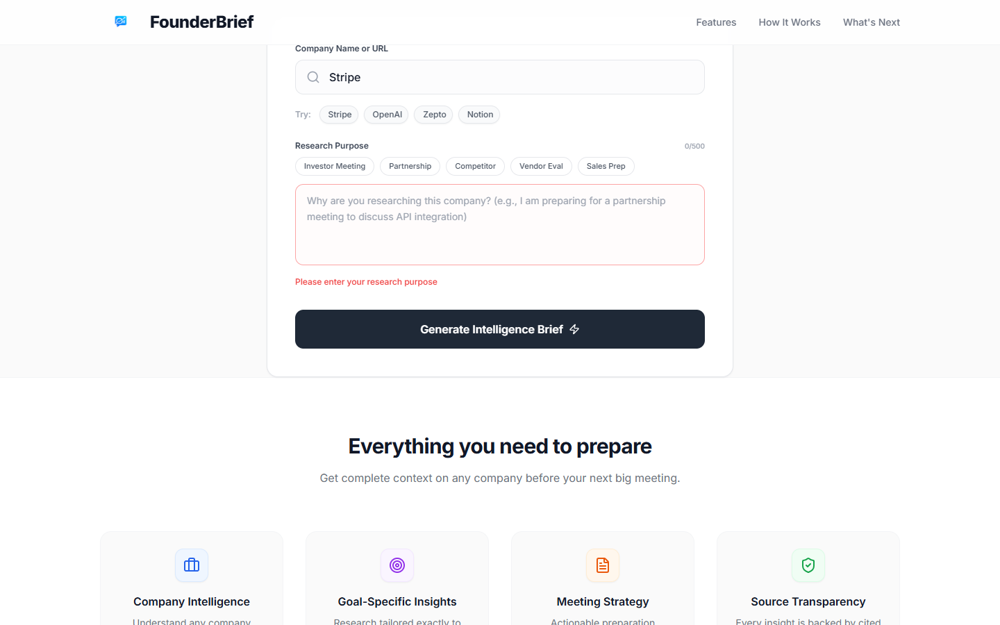

# Founder Brief - Demo & Screenshots

This file contains visual documentation of the Founder Brief application in action, demonstrating the user journey from the landing page to the generated intelligence brief.

## 1. Landing Page
The clean, modern UI where users enter the company name and optional context.

## 2. Research Generation Flow
The intelligent loading screen that provides psychological feedback to the user while the backend performs real-time data scraping and AI synthesis.

## 3. Demo Video
A full walkthrough of the application capturing the interactive experience, dynamic animations, and the final generated output (Intelligent Brief and Meeting Strategy).

